# discrete-random-variables

Figure 1 shows the CDF of maximum and minimum of $X_1$, $X_2$ and $X_3$ ; in which $X_i$ are independent.

$p_1$, $p_2$ and $p_3$ relatively represent the pmf of $X_1$, $X_2$ and $X_3$.
 $p_1$ = [.1 .0 .9 .0]
 $p_2$ = [.5 .2 .1 .2]
 $p_3$ = [.4 .3 .2 .1]
 The CDF of $X_{max} = max(X_1, X_2, X_3)$ and $X_{min} = min(X_1, X_2, X_3)$ have shown in figure 1.

<table width="100%">
  <tr>
    <td width="50%">
      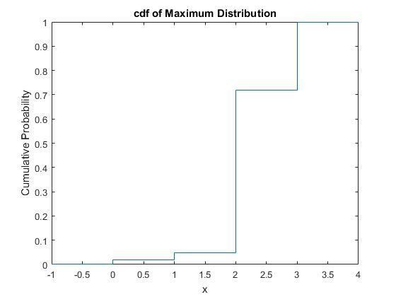
    </td>
    <td width="50%">
      
    </td>
  </tr>
</table>

  <caption>figure 1: The CDF of Max/Min of $X_1$, $X_2$ and $X_3$</caption>

 
 

Figure 2 shows the CDF and PMF of Bernoulli(p = 0.75) distribution.

<table width="100%">
  <tr>
    <td width="50%">
      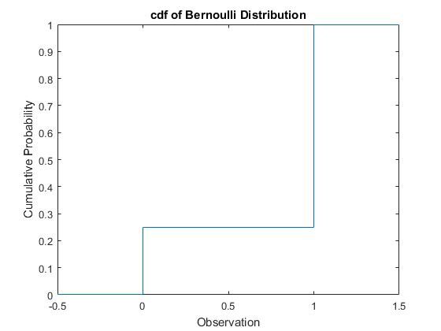
    </td>
    <td width="50%">
      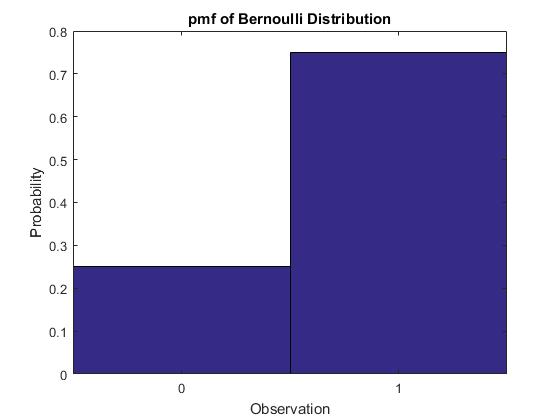
    </td>
  </tr>
</table>

  <caption>figure 2: The CDF and PMF of Bernoulli Distribution</caption>

 
 

The CDF and PMF of Binomial(n = 10, p = 0.5) distribution have been shown in figure 3.

<table width="100%">
  <tr>
    <td width="50%">
      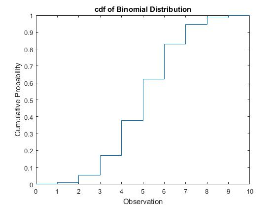
    </td>
    <td width="50%">
      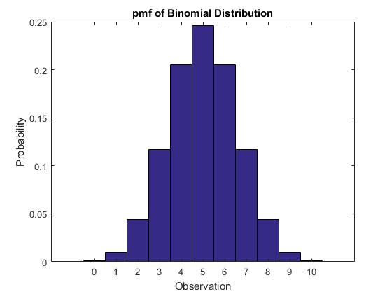
    </td>
  </tr>
</table>

  <caption>figure 3: The CDF and PMF of Binomial Distribution</caption>

 
 

Figure 4 shows the fact that when n -> $\infty$ and p -> 0 => Binomial(n, p) -> Poisson(λ = n $\times$ p)

This figure has been plotted for n = 50 and p = 0.01.

<table width="100%">
  <tr>
    
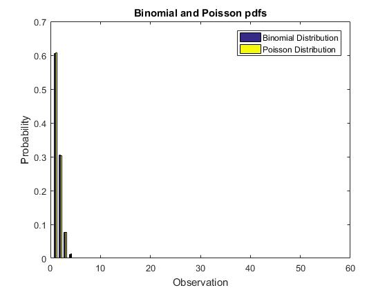

  </tr>
</table>

  <caption>figure 4: Binomial Distribution vs Poisson Distribution</caption>

 
 

The PMF of Multinomial distribution X where X = $X_1$ + $X_2$ in which $X_1$~Binomial(3, 0.5), $X_2$~Binomial(4, 0.5) has been shown in figure 5.

<table width="100%">
  <tr>
    
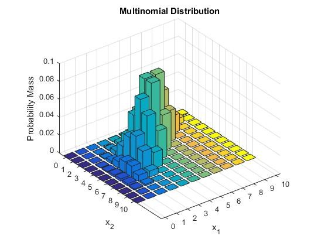

  </tr>
</table>

  <caption>figure 5: The PMF of Multinomial Distribution</caption>

 
 

The CDF abd PMF of Geometric distribution with p = 0.5 have been shown in figure 6.

<table width="100%">
  <tr>
    <td width="50%">
      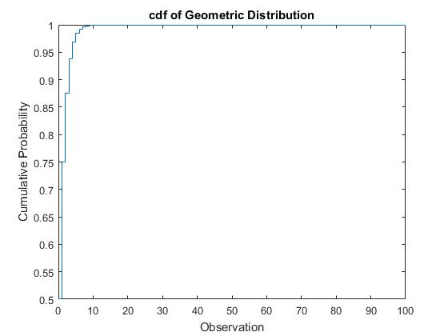
    </td>
    <td width="50%">
      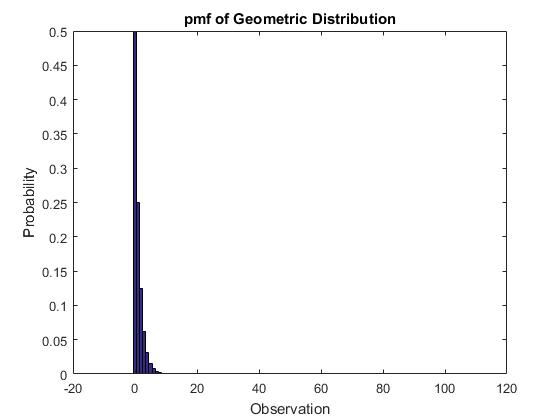
    </td>
  </tr>
</table>

  <caption>figure 6: The CDF and PMF of Geometric Distribution</caption>

 
 

The CDF and PMF of Negative Binomial distribution with R=3 and p = 0.5 have been shown in figure 7.

<table width="100%">
  <tr>
    <td width="50%">
      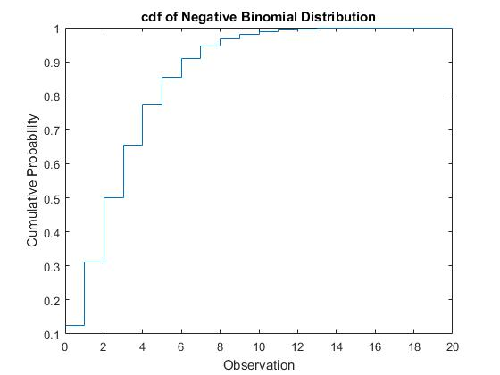
    </td>
    <td width="50%">
      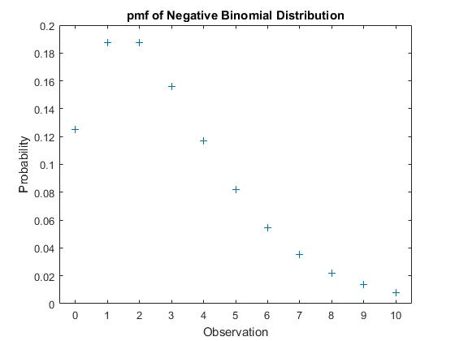
    </td>
  </tr>
</table>

  <caption>figure 7: The CDF and PMF of Negative Binomial Distribution</caption>

 
 

The CDF and PMF of Poisson distribution with λ=5 has been shown in figure 8.

<table width="100%">
  <tr>
    <td width="50%">
      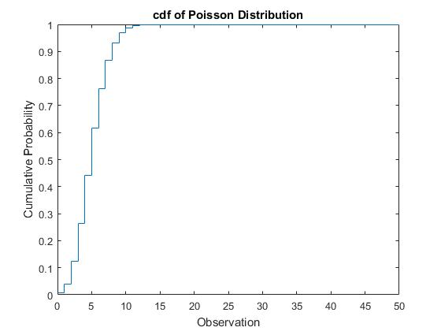
    </td>
    <td width="50%">
      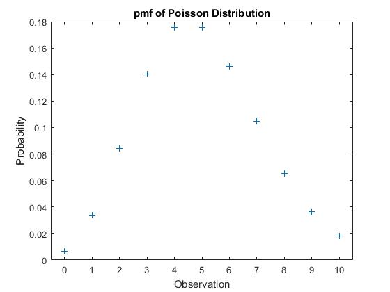
    </td>
  </tr>
</table>

  <caption>figure 8: The CDF and PMF of Poisson Distribution</caption>

 

### Requirements 🔧
* 
* 

### How to contribute to this repository 
. Press the **Fork** button in order to save copy of this repo on your account.

. Download the files by pressing download button or clone this repo by the the following command in your git bash:

       https://github.com/Taabannn/discrete-random-variables.git
       
. Open project in jupyter notebook.

. Make a new branch.
 
       git checkout -b branch-name
. Make new changes of repository on new branch.

. Push the changes.

       git add .
       git commit -m "Your commit Message"
       git push origin branch-name
. Make a pull request.

. ⭐ this repository.
