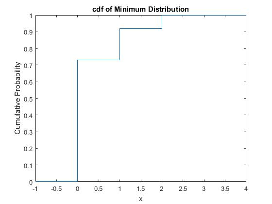

# discrete-random-variables

<table width="100%">
  <tr>
    <td width="50%">
      
    </td>
    <td width="50%">
      
    </td>
  </tr>
</table>

<table width="100%">
  <tr>
    <td width="50%">
      
    </td>
    <td width="50%">
      
    </td>
  </tr>
</table>

<table width="100%">
  <tr>
    <td width="50%">
      
    </td>
    <td width="50%">
      
    </td>
  </tr>
</table>

<table width="100%">
  <tr>
    

  </tr>
</table>

<table width="100%">
  <tr>
    

  </tr>
</table>

<table width="100%">
  <tr>
    <td width="50%">
      
    </td>
    <td width="50%">
      
    </td>
  </tr>
</table>

<table width="100%">
  <tr>
    <td width="50%">
      
    </td>
    <td width="50%">
      
    </td>
  </tr>
</table>

<table width="100%">
  <tr>
    <td width="50%">
      
    </td>
    <td width="50%">
      
    </td>
  </tr>
</table>

 
 
 

### Requirements 🔧
* 

### How to contribute to this repository 
. Press the **Fork** button in order to save copy of this repo on your account.

. Download the files by pressing download button or clone this repo by the the following command in your git bash:

       https://github.com/Taabannn/discrete-random-variables.git
       
. Open project in jupyter notebook.

. Make a new branch.
 
       git checkout -b branch-name
. Make new changes of repository on new branch.

. Push the changes.

       git add .
       git commit -m "Your commit Message"
       git push origin branch-name
. Make a pull request.

. ⭐ this repository.
